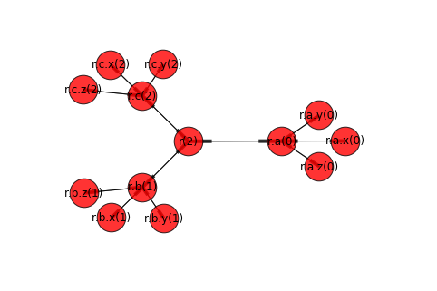

#tega db


Project start: 2014/8/8



Distributed document-oriented database for small PCs (incl. Raspberry Pi), written in Python:
- [Tornado](http://www.tornadoweb.org/en/stable/)-based
- CRUD/RPC supported
- Transaction supported
- JSON-oriented (not YANG)
- Schema-less
- Extensible with plugins
- NAT traversal (HTTP/WebSocket)
- Python and Go driver
- Easy to use
```
$ tega-cli
tega CLI (q: quit, h:help)
[tega: 0] put a.b.c
1

[tega: 1] put a.x
2

[tega: 2] get a
b: {c: 1}
x: 2
```

##Design policy
- Simplicity rather than high-performance and rigid schema
- NOSQL for non big data (small data)
- Embeddable data base
- Focus on config and operational data management
- Support various integration patterns: data change notification, messaging and rpc
- Easy-to-use APIs
- Concurrenty support with coroutine

##Project goal


##Use cases
- [NLAN](https://github.com/araobp/nlan)
- BBR remote config
- OpenWrt remote config
- Instant VPN (L2 or L3)
- IOT


##Installation

You need to have python3.5 installed on your Debian/Ubuntu Linux.

```
$ pip install tornado
$ pip install httplib2
$ pip install pyyaml
$ pip install readline
$ git clone http://github.com/araobp/tega
$ cd tega
$ python setup.py install
```

Start tega server with sample options, like this:
```
$ cd tega/scripts
$ ./global
```

And start tega CLI to use CLI commands:
```
$ tega-cli
```


##Current architecture
```
                           [cli.py]
                               |
                          [driver.py]
                               |  |
         +---------------------+  +-----------------------+
         |                                                |
     Tornado                                          Tornado 
     [server.py] ------------ REST/WebSocket ---------[server.py]
         :                                                : 
     [idb.py]...[tree.py]                             [idb.py]...[tree.py]
         :                                                :
     --------                                         --------
    /tega.db/                                        /tega.db/
   ---------                                        ---------
   commit-log                                       commit-log
```

##Documentation

###Specification
- [tree structure](./doc/tree.png)
- [tree structure implemention: Cont class and its attributes](./doc/attributes.md)
- [YANG-tega comparisons](./doc/yang-tega-comparisons.md)
- [tega message format](./doc/message-format.md)
- [tega message sequence diagram](./doc/message-sequence.md)
- [tega db commit-log format](./doc/tega-db-format.md)
- [sync path and notifications](./doc/sync_path_and_notifications.md)
- [subscription scope](./doc/subscription_scope.md)
- [Guideline](./doc/guideline.md)

###Usage
- [CLI command usage](./doc/usage.md)
- [data visualization by using Jupyter notebook](./doc/jupyter.md)

###CRUD operations


###Rollback


###Consistency


###Collision detection


###Garbage collection


###RPC routing


###Integration patterns


For example,
- [My neutron-lan project](https://github.com/araobp/neutron-lan) has taken the pattern [D]. The implementation of the agent is not simple.
- [My nlan project](https://github.com/araobp/nlan) has been taking the pattern [A], since Docker is for an immutable infrastructure. The implementation of the agent is quite simple.
- In general, commercial-grade network controllers take the pattern [E]. It requires a development team with a lot of software engineers.
- Signalling protocol developers think differently... [My another drawing](https://docs.google.com/drawings/d/1x8mm-h4Gxn8rfL7fV-2sgnjpxejSaR8cLfzr9vNJFu4/pub?w=960&h=720)

You had better study how databases (incl. NOSQL ones) realize data synchronization in a cluster.

##Note

####Implementation
- Tega db is still in alpha release and part of the documentation here has not been implemented yet.

####Performance
it is a schema-less database and the performance (especially write-performance) of this database is not good:
- dynamic typing
- nested hash map (hash collisions, rehashing...)
- it makes use of for-loop a lot (Python's for-loop performance is not good)
- it saves every commit log onto a storage

##References
* [ZooKeeper](https://www.usenix.org/legacy/event/atc10/tech/full_papers/Hunt.pdf)
* [Cassandra](http://wiki.apache.org/cassandra/ArticlesAndPresentations)
* [Hazelcast](https://hazelcast.org/)
* [OVSDB(RFC7047)](https://tools.ietf.org/html/rfc7047)
* [YANG(RFC6020)](https://tools.ietf.org/html/rfc6020)
* [OpenDaylight MD-SAL datastore](https://wiki.opendaylight.org/view/OpenDaylight_Controller:MD-SAL:Architecture:DOM_DataStore)
* [OpenWRT UCI](https://wiki.openwrt.org/doc/uci)
