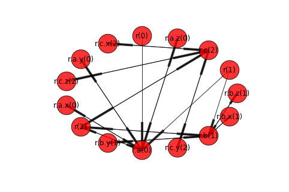

```python
import networkx as nx
%matplotlib inline
```


```python
import tega.driver
d = tega.driver.Driver()
```


```python
_, _, edges = d.edges(root_oid='r', old_roots=False)
instance=d.get(path='r')
print(instance)
```

    {'c': {'z': 9, 'x': 7, 'y': 8}, 'a': {'z': 3, 'x': 1, 'y': 2}, 'b': {'z': 6, 'x': 4, 'y': 5}}


```python
g = nx.DiGraph(edges)
nx.draw_spring(g, node_size=1000, with_labels=True, arrows=True, alpha=0.8)
_, _, edges = d.edges(root_oid='r', old_roots=True)
```


```python
instance=d.get(path='r', internal=True, python_dict=True)
print(instance)
```

    {'_ephemeral': False, 'c': {'_ephemeral': False, '_parent': 'r', 'x': {'_value': 7, '_version': 2, '_oid': 'x', '_parent': 'c', '_ephemeral': False}, 'y': {'_value': 8, '_version': 2, '_oid': 'y', '_parent': 'c', '_ephemeral': False}, '_version': 2, '_oid': 'c', 'z': {'_value': 9, '_version': 2, '_oid': 'z', '_parent': 'c', '_ephemeral': False}}, 'b': {'_ephemeral': False, '_parent': 'r', 'x': {'_value': 4, '_version': 1, '_oid': 'x', '_parent': 'b', '_ephemeral': False}, 'y': {'_value': 5, '_version': 1, '_oid': 'y', '_parent': 'b', '_ephemeral': False}, '_version': 1, '_oid': 'b', 'z': {'_value': 6, '_version': 1, '_oid': 'z', '_parent': 'b', '_ephemeral': False}}, 'a': {'_ephemeral': False, '_parent': 'r', 'x': {'_value': 1, '_version': 0, '_oid': 'x', '_parent': 'a', '_ephemeral': False}, 'y': {'_value': 2, '_version': 0, '_oid': 'y', '_parent': 'a', '_ephemeral': False}, '_version': 0, '_oid': 'a', 'z': {'_value': 3, '_version': 0, '_oid': 'z', '_parent': 'a', '_ephemeral': False}}, '_parent': None, '_version': 2, '_oid': 'r'}


```python
g = nx.DiGraph(edges)
nx.draw_circular(g, node_size=1000, with_labels=True, arrows=True, alpha=0.8)
```




